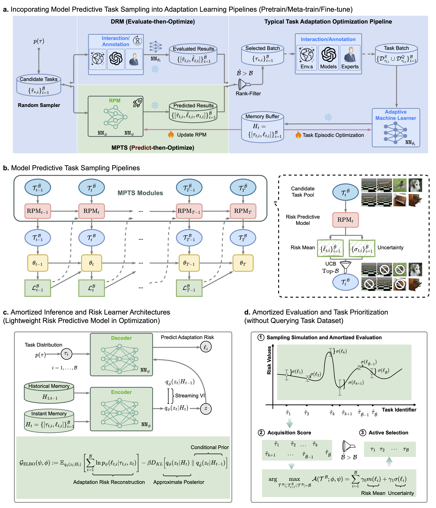
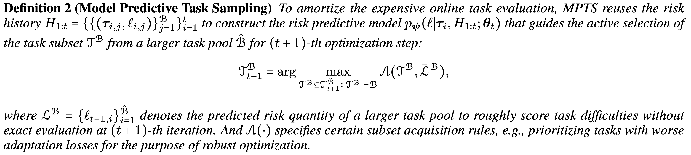
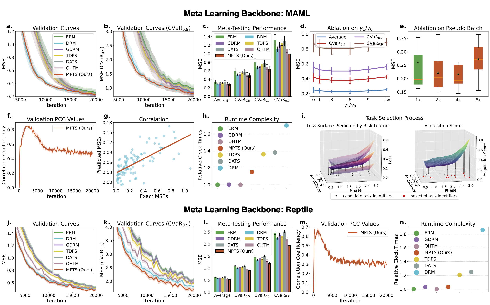

# MPTS: Model Predictive Task Sampling

<div align="center">

[](https://arxiv.org/abs/2501.11039)
[](https://www.thuidm.com/)
[](https://github.com/thu-rllab/MPTS)

</div>

This repository implements the MPTS (Model Predictive Task Sampling) and baselines proposed in the paper [**"Model Predictive Task Sampling for Efficient and Robust Adaptation"**](https://arxiv.org/abs/2501.11039).

Framework of MPTS in Adaptation Learning:



## 🔧 Installation & Applications
Please refer to the following folders for related instructions and code:
- [`sinusoid/`](sinusoid/): Code related to sinusoid regression
- [`MetaRL/`](MetaRL/): Code related to Meta RL scenarios
- [`DR/`](DR/): Code related to Domain Randomization scenarios

K-shot Sinusoid Regression Results (10 Runs):


## 🚀 Tutorials & Quickstart

Get started with our [quickstart.ipynb](./quickstart.ipynb) notebook, which provides an interactive introduction to the MPTS approach using the sinusoid regression scenario.

## 📝 Citation

If you find this work useful for your research, please consider referring to our paper:
```bibtex
@article{wang2025model,
  title={Model predictive task sampling for efficient and robust adaptation},
  author={Wang, Qi Cheems and Xiao, Zehao and Mao, Yixiu and Qu, Yun and Shen, Jiayi and Lv, Yiqin and Ji, Xiangyang},
  journal={arXiv preprint arXiv:2501.11039},
  year={2025}
}
```

The following includes key baselines and relevant literature. If you are interested in robust fast adaptation methods, please consider referring to them.
```bibtex
@inproceedings{he2024robust,
  title={Robust Multi-Task Learning with Excess Risks},
  author={He, Yifei and Zhou, Shiji and Zhang, Guojun and Yun, Hyokun and Xu, Yi and Zeng, Belinda and Chilimbi, Trishul and Zhao, Han},
  booktitle={International Conference on Machine Learning},
  pages={18094--18114},
  year={2024},
  organization={PMLR}
}
@article{wang2024towards,
  title={Towards task sampler learning for meta-learning},
  author={Wang, Jingyao and Qiang, Wenwen and Su, Xingzhe and Zheng, Changwen and Sun, Fuchun and Xiong, Hui},
  journal={International Journal of Computer Vision},
  volume={132},
  number={12},
  pages={5534--5564},
  year={2024},
  publisher={Springer}
}
@inproceedings{liu2020adaptive,
  title={Adaptive task sampling for meta-learning},
  author={Liu, Chenghao and Wang, Zhihao and Sahoo, Doyen and Fang, Yuan and Zhang, Kun and Hoi, Steven CH},
  booktitle={European Conference on Computer Vision},
  pages={752--769},
  year={2020},
  organization={Springer}
}
@inproceedings{toloubidokhti2023dats,
  title={Dats: Difficulty-aware task sampler for meta-learning physics-informed neural networks},
  author={Toloubidokhti, Maryam and Ye, Yubo and Missel, Ryan and Jiang, Xiajun and Kumar, Nilesh and Shrestha, Ruby and Wang, Linwei},
  booktitle={The Twelfth International Conference on Learning Representations},
  year={2023}
}
@article{yao2021meta,
  title={Meta-learning with an adaptive task scheduler},
  author={Yao, Huaxiu and Wang, Yu and Wei, Ying and Zhao, Peilin and Mahdavi, Mehrdad and Lian, Defu and Finn, Chelsea},
  journal={Advances in Neural Information Processing Systems},
  volume={34},
  pages={7497--7509},
  year={2021}
}
@article{kaddour2020probabilistic,
  title={Probabilistic active meta-learning},
  author={Kaddour, Jean and S{\ae}mundsson, Steind{\'o}r and others},
  journal={Advances in Neural Information Processing Systems},
  volume={33},
  pages={20813--20822},
  year={2020}
}
@inproceedings{kumar2023effect,
  title={The effect of diversity in meta-learning},
  author={Kumar, Ramnath and Deleu, Tristan and Bengio, Yoshua},
  booktitle={Proceedings of the AAAI Conference on Artificial Intelligence},
  volume={37},
  number={7},
  pages={8396--8404},
  year={2023}
}
@article{greenberg2024train,
  title={Train hard, fight easy: Robust meta reinforcement learning},
  author={Greenberg, Ido and Mannor, Shie and Chechik, Gal and Meirom, Eli},
  journal={Advances in Neural Information Processing Systems},
  volume={36},
  year={2024}
}
@inproceedings{sagawa2019distributionally,
  title={Distributionally Robust Neural Networks},
  author={Sagawa, Shiori and Koh, Pang Wei and Hashimoto, Tatsunori B and Liang, Percy},
  booktitle={International Conference on Learning Representations},
  year={2019}
}
@article{wang2024simple,
  title={A Simple Yet Effective Strategy to Robustify the Meta Learning Paradigm},
  author={Wang, Qi and Lv, Yiqin and Xie, Zheng and Huang, Jincai and others},
  journal={Advances in Neural Information Processing Systems},
  volume={36},
  year={2024}
}
```